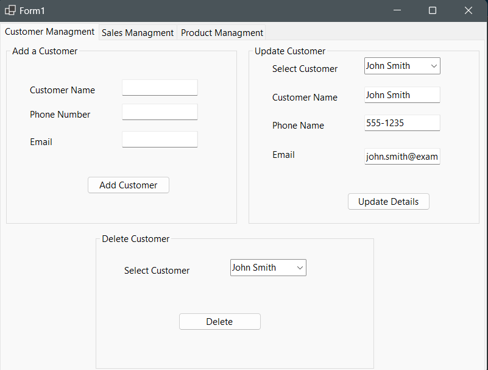
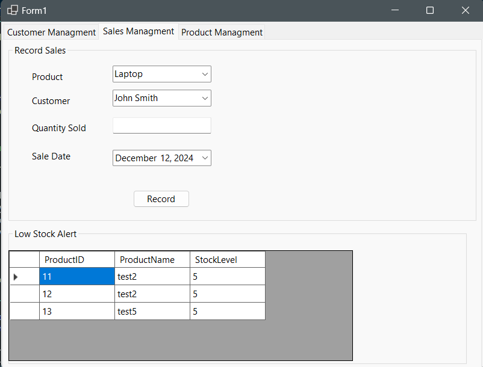
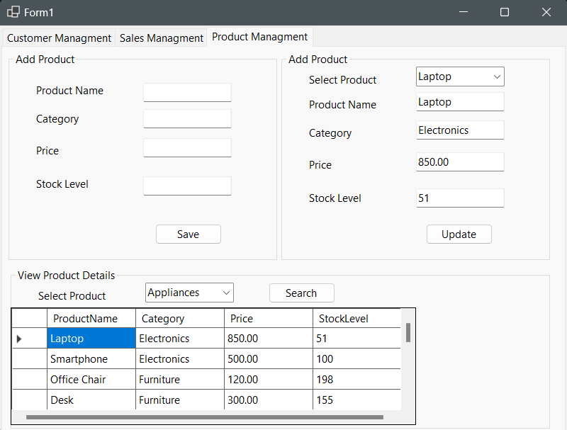

# 🚀 Product Inventory Management System

**A Windows Forms application built with C# .NET and SQL Server to manage products, customers, and sales seamlessly.**  

---

## 🎯 About the Project

The **Product Inventory Management System** simplifies the process of managing products, customers, and sales. Designed with a clean UI and intuitive workflows, this application enables quick record addition, updates, deletion, and product search functionality.

---

## ✨ Key Features

- 🔹 **Customer Management**: Add, update, and delete customer records.  
- 🔹 **Product Management**: Manage product details, including category, price, and stock levels.  
- 🔹 **Sales Management**: Track sales and monitor inventory.  
- 🔹 **Search Functionality**: Quickly search products by **category** using dropdown filters.  
- 🔹 **Low Stock Alerts**: Get notified when product stock levels run low.  

---

## 🛠 Tech Stack

- **Frontend**: Windows Forms (WinForms)  
- **Backend**: C# .NET  
- **Database**: SQL Server  
- **IDE**: Visual Studio  

---

## ⚙️ Installation

Follow these steps to set up and run the project locally:

1. **Clone the Repository**  
   ```bash
   git clone https://github.com/yourusername/product-inventory-management.git
   cd product-inventory-management
   ```

2. **Set Up SQL Database**  
   - Open **SQL Server Management Studio (SSMS)**.  
   - Run the provided `DatabaseScript.sql` file to create tables and sample data.

3. **Configure the Connection String**  
   Update the connection string in `DatabaseHelper.cs`:  
   ```csharp
   "Server=YOUR_SERVER_NAME;Database=InventoryDB;Trusted_Connection=True;"
   ```

4. **Build and Run the Project**  
   - Open the solution in **Visual Studio**.  
   - Build the project using `Ctrl + Shift + B`.  
   - Run the project with `F5`.  

---

## 🚀 Usage

1. **Manage Customers**  
   - Add, update, and delete customers.  

2. **Manage Products**  
   - Add products with details like name, category, price, and stock.  
   - Update or delete existing product records.  

3. **Search Products**  
   - Use the **category dropdown** to filter products quickly.  

4. **Track Inventory**  
   - View **low-stock alerts** to restock items.  

---

## 📸 Screenshots

### Customer Management  


### Stock Management  


### Product Management  



---

## 🗄 Database Schema

| **Table Name** | **Columns**                                |  
|-----------------|--------------------------------------------|  
| **Customers**  | `CustomerID`, `CustomerName`, `PhoneNumber`, `Email` |  
| **Products**   | `ProductID`, `ProductName`, `Category`, `Price`, `StockLevel` |  
| **Sales**      | `SaleID`, `ProductID`, `Quantity`, `Date`  |  

---

## 🚧 Future Enhancements

- 📊 Generate **reports** for sales and inventory.  
- 🔔 Add **real-time notifications** for critical stock levels.  
- 🌐 Export data to **Excel or PDF** for analysis.  
- 🛡 Add **user authentication** for enhanced security.

---

## 👤 Author

**Your Name**  
- 💼 **LinkedIn**: [My LinkedIn Profile](https://www.linkedin.com/in/negar-pirasteh/)  
- 💻 **GitHub**: [My GitHub Profile](https://github.com/negarprh)  
- 📧 **Email**: negarprh@hotmail.com  

---

## ⭐ Show Your Support

If you find this project helpful, please ⭐ **star** the repository! Contributions, feedback, and suggestions are welcome. 🚀  

